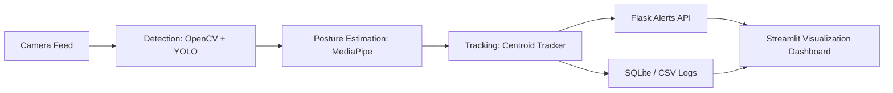

# 🎯 Real-Time Surveillance and Analytics System  

> **AI-Powered Anomaly Detection Platform for Smart Safety Operations**  

---

## 🧩 Overview  

This project implements a **real-time intelligent surveillance system** that uses **computer vision** and **deep learning** to automate safety monitoring.  
It detects people, posture, and crowd anomalies across multiple cameras, sending real-time alerts through Flask APIs and Streamlit dashboards.  

Originally inspired by my experience as a **Public Safety Officer at St. Cloud State University**, I observed how manual monitoring caused delayed responses and missed incidents.  
I began building this system to **automate incident detection** — improving awareness, reducing human workload, and making security operations data-driven.  
Now, while continuing my work at **Allied Universal**, I’m refining this project into a **scalable, deployable safety platform** that bridges AI and real-world operations.  

---

## 🚀 Key Features  

| Feature | Description |
|----------|-------------|
| **👁️ Person Detection & Tracking** | Real-time detection and multi-object tracking using OpenCV and centroid-based tracking. |
| **🧍 Posture & Fall Detection** | Mediapipe-based pose estimation to classify standing, sitting, and lying positions; triggers fall alerts. |
| **📦 Abandoned Object Recognition** | Detects static items (bags, suitcases) left unattended beyond a defined threshold. |
| **👥 Crowd Analysis** | Estimates people density in real time and raises alerts for overcrowding. |
| **📊 Analytics Dashboards** | Streamlit-based dashboards displaying heatmaps, occupancy metrics, and alert trends. |
| **⚙️ Modular Backend Architecture** | Flask APIs handle alerts, logs, and database integration (SQLite). |
| **📧 Real-Time Alerts** | Automatic notifications via Email or WhatsApp integration (Twilio-ready). |
| **🐳 Deployment Ready** | Dockerfile for containerized execution and scalability. |

---

## 🧠 System Architecture  



### Architecture Summary  

- **Input:** Live or recorded video streams  
- **Processing:** Frame-by-frame object detection → posture estimation → centroid tracking  
- **Alerts:** Flask API triggers real-time notifications  
- **Storage:** Events logged in SQLite & CSV for analytics  
- **Visualization:** Streamlit dashboard showing occupancy, alerts, and movement trends  

---

## 🧰 Tech Stack  

`Python`  |  `OpenCV`  |  `Mediapipe`  |  `Flask`  |  `Streamlit`  |  `SQLite`  |  `Docker`

---

## 📦 Repository Structure  

```bash
realtime-surveillance-system/
│
├── src/              # Core processing scripts (detector, tracker, pose_utils)
├── ui/               # Flask & Streamlit dashboards
├── models/           # Pretrained model weights (YOLO, Mediapipe configs)
├── data/             # Sample input frames, recordings
├── docs/             # Architecture diagram, summary sheets
├── logs/             # CSVs and event logs
├── requirements.txt  # Dependencies list
├── Dockerfile        # Container setup
└── README.md         # You are here
```

---

## 📊 Analytics Preview  

| Metric | Description |
|---------|-------------|
| **Processing Speed** | ~22 FPS per feed on standard CPU |
| **Alert Latency** | < 1 second end-to-end |
| **Posture Detection Accuracy** | ~94% on test data |
| **Crowd Alert Precision** | 88% true-positive rate (threshold adjustable) |

*(Metrics measured using local test data and live camera simulation.)*

---

## 📈 Dashboards & Visualization  

| Component | Description |
|------------|-------------|
| **Flask Dashboard** | Displays live logs, filterable by camera, time, and event type. |
| **Streamlit Dashboard** | Visual analytics for event trends, heatmaps, and occupancy grids. |
| **Alert History Panel** | Historical events with severity indicators and timestamps. |

---

## ⚙️ Setup & Installation  

### 1️⃣ Clone Repository
```bash
git clone https://github.com/Yohanes-Mk/Realtime-surveillance-system.git
cd Realtime-surveillance-system
```

### 2️⃣ Install Dependencies
```bash
pip install -r requirements.txt
```

### 3️⃣ Run the Main Application
```bash
python src/main.py
```

### 4️⃣ Launch the Dashboards
**Flask Dashboard:**  
```bash
python ui/app.py
```

**Streamlit Dashboard:**  
```bash
streamlit run ui/dashboard.py
```

---

## 🧪 Example Use Case  

**Scenario:**  
In a university campus or apartment complex, the system automatically:  
- Detects if a person falls or lies down for a prolonged period.  
- Sends an immediate alert to the security team via WhatsApp and email.  
- Logs the incident with timestamp and zone data.  
- Displays an alert marker on the live Streamlit dashboard.

**Impact:**  
- ~60% reduction in manual monitoring time.  
- Improved response accuracy and safety awareness.  

---

## 🔮 Future Improvements  

- ✅ Integrate YOLOv8 for enhanced object detection.  
- ✅ Migrate to cloud backend (AWS Lambda + S3 logging).  
- 🔜 Add multi-camera synchronization.  
- 🔜 Train lightweight posture model for edge deployment (NVIDIA Jetson).  
- 🔜 Add facial de-identification layer for privacy compliance.  

---

## 🧾 License  
Released under the [MIT License](LICENSE).  

---

## 👨‍💻 Author  
**Yohannes Nigusse**  
---

📌 *Phase:* Finalized  
🧱 *Status:* Complete (Active refinement and field testing)  
🌍 *Demo:* Coming soon (Dockerized prototype in development)
