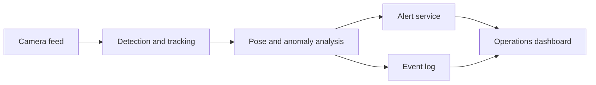

# Real-Time Surveillance and Analytics System

A documented computer-vision safety-analytics concept for turning camera feeds into detected events, operational alerts, and reviewable metrics.

## Status

This repository is a **project documentation archive**. It does not currently include the implementation, trained models, sample footage, deployment configuration, or a runnable dashboard. The README therefore describes the intended system design rather than claiming a deployable product.

## Intended architecture

```mermaid
flowchart LR
    A[Camera feed] --> B[Detection and tracking]
    B --> C[Pose and anomaly analysis]
    C --> D[Alert service]
    C --> E[Event log]
    D --> F[Operations dashboard]
    E --> F
```

The planned system combines object detection, pose estimation, and tracking to identify operational events. It proposes a Flask alert service, SQLite or CSV event logs, and a Streamlit review dashboard.

## Design reference

[Project summary](docs/Project_Summary.md) records the proposed folder boundaries, dependencies, architecture diagram, and future improvements.

## Scope note

This project should be viewed as an architecture and product concept. It is not a production surveillance tool, and it should not be used to make safety-critical decisions.

## License

No license is currently supplied. Do not assume reuse rights beyond GitHub's default repository visibility.
