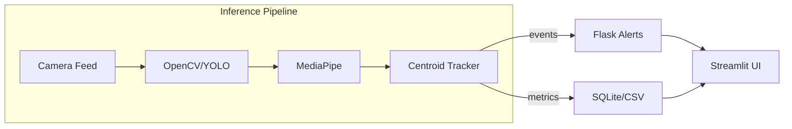

# Project Summary Sheet – Real-Time Surveillance and Analytics System

## 1. Folder Purpose
| Folder | Purpose |
|---------|----------|
| **src/** | Core source code (processing, detection, tracking) |
| **data/** | Sample input videos or images for testing |
| **docs/** | Architecture diagrams, framework, and documentation |
| **models/** | Pretrained model weights (YOLO, Mediapipe configs) |
| **ui/** | Dashboards and frontend components (Flask/Streamlit) |
| **logs/** | Event CSVs, alert logs, heatmaps |
| **tests/** | Automated tests (future phase) |

## 2. Dependencies & Libraries
`Python 3.0` • `OpenCV` • `Mediapipe` • `Flask` • `Streamlit` • `Docker` • `SQLite`

## 3. System Architecture (to be expanded)
High-level flow:

## 4. Planned Improvements
- Integrate YOLOv8 for higher-accuracy detection  
- Add Docker Compose for dual-service deployment (Flask + Streamlit)  
- Create architecture diagram 
